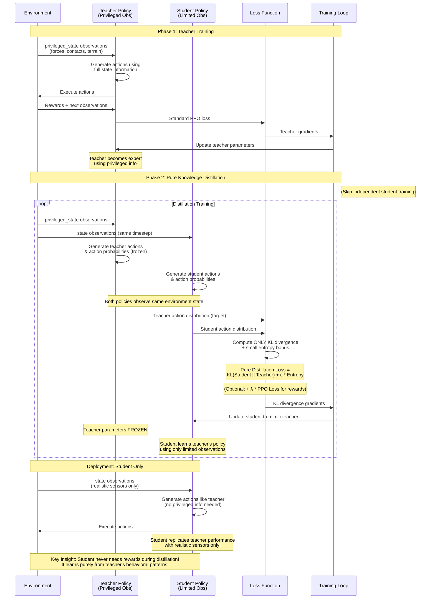

```mermaid
sequenceDiagram
    participant Env as Environment
    participant Teacher as Teacher Policy<br/>(Privileged Obs)
    participant Student as Student Policy<br/>(Limited Obs)
    participant Loss as Loss Function
    participant Trainer as Training Loop

    Note over Env, Trainer: Phase 1: Teacher Training
    
    Env->>Teacher: privileged_state observations<br/>(forces, contacts, terrain)
    Teacher->>Teacher: Generate actions using<br/>full state information
    Teacher->>Env: Execute actions
    Env->>Teacher: Rewards + next observations
    Teacher->>Loss: Standard PPO loss
    Loss->>Trainer: Teacher gradients
    Trainer->>Teacher: Update teacher parameters
    
    Note over Teacher: Teacher becomes expert<br/>using privileged info
    
    Note over Env, Trainer: Phase 2: Pure Knowledge Distillation
    Note right of Trainer: (Skip independent student training)
    
    loop Distillation Training
        Env->>Teacher: privileged_state observations
        Env->>Student: state observations (same timestep)
        
        Teacher->>Teacher: Generate teacher actions<br/>& action probabilities (frozen)
        Student->>Student: Generate student actions<br/>& action probabilities
        
        Note over Teacher, Student: Both policies observe same environment state
        
        Teacher->>Loss: Teacher action distribution (target)
        Student->>Loss: Student action distribution
        
        Loss->>Loss: Compute ONLY KL divergence<br/>+ small entropy bonus
        
        Note over Loss: Pure Distillation Loss =<br/>KL(Student || Teacher) + ε * Entropy
        Note over Loss: (Optional: + λ * PPO Loss for rewards)
        
        Loss->>Trainer: KL divergence gradients
        Trainer->>Student: Update student to mimic teacher
        Note over Teacher: Teacher parameters FROZEN
        
        Note over Student: Student learns teacher's policy<br/>using only limited observations
    end
    
    Note over Env, Student: Deployment: Student Only
    
    Env->>Student: state observations<br/>(realistic sensors only)
    Student->>Student: Generate actions like teacher<br/>(no privileged info needed)
    Student->>Env: Execute actions
    
    Note over Student: Student replicates teacher performance<br/>with realistic sensors only!

    Note over Env, Student: Key Insight: Student never needs rewards during distillation!<br/>It learns purely from teacher's behavioral patterns.
```